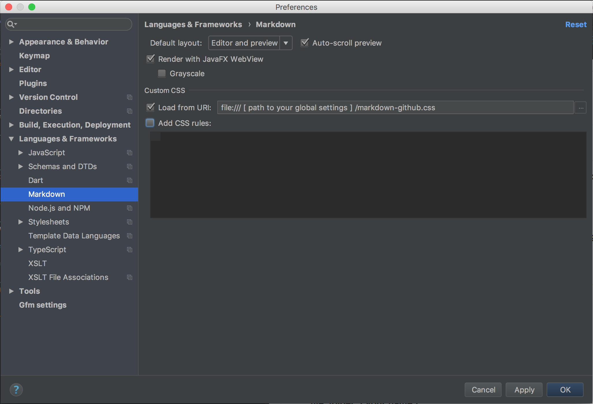

# webstorm-helpers
Style, preference, plugins and other things to help development in the Webstorm IDE.

### Markdown for Github
This is an attempt to make the preview in the Markdown plugin for Webstorm to mirror the Github ReadMe style. It's far from complete and a lot of it came from trial and error since I can't inspect the Webstorm html preview.

_Confirmed working in 2017.3_

